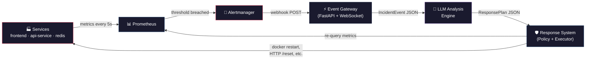
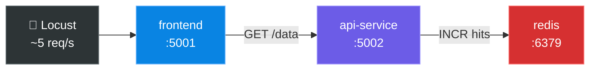

# Intelligent DevOps Monitoring & Incident Response — How It Works

## The Big Picture

This is a **self-healing DevOps system**. Instead of just raising alerts and waiting for a human to fix things, it uses an LLM (like Claude or a local Ollama model) to **diagnose the problem, decide on a fix, execute it, and verify it actually worked** — all automatically.



The loop: **Monitor → Detect → Analyze → Decide → Respond → Verify → (repeat if not fixed)**

---

## Component-by-Component Breakdown

### 1. The Demo Services (the "infrastructure being monitored")

The system monitors a **multi-service web application** that simulates a real microservice architecture:



| Service | File | Role |
|---------|------|------|
| **frontend** | [`app/app.py`](file:///Users/shayaan/Desktop/intellegent%20devops/app/app.py) | User-facing Flask app on port 5001. Calls `api-service` on every request. |
| **api-service** | [`api-service/app.py`](file:///Users/shayaan/Desktop/intellegent%20devops/api-service/app.py) | Backend Flask app on port 5002. Increments a counter in Redis. |
| **redis** | Redis 7 Alpine container | Data store. |

**Every service exposes:**
- `GET /health` — health status + active fault flags
- `GET /metrics` — Prometheus metrics (request count, latency histogram, upstream latency, fault gauges)
- `POST /inject` — trigger a fault (cpu, memory, latency, error)
- `POST /reset` — clear all active faults

#### How the fault injection works internally

Each Flask app has an identical fault engine ([`app/app.py` lines 70–223](file:///Users/shayaan/Desktop/intellegent%20devops/app/app.py#L70-L223)):

| Fault | What it does | How it clears |
|-------|-------------|---------------|
| **cpu** | Spawns a thread that runs `_ = 1234567 * 7654321` in a tight loop, pegging the container's CPU | Timer thread after `duration` seconds, or `/reset` |
| **memory** | Allocates `size_mb` of `bytearray(b"\x01" * ...)` in 10 MB chunks (non-zero bytes so the OS actually commits the pages) | Timer thread, or `/reset` (frees the reference → GC) |
| **latency** | Adds `time.sleep(5)` before every request handler | Timer thread, or `/reset` |
| **error** | Returns HTTP 500 for every request | Timer thread, or `/reset` |

A **generation counter** prevents race conditions — an old timer thread can't accidentally clear a newer fault injection.

The **upstream latency histogram** (`upstream_request_duration_seconds`) is critical: it measures how long `frontend` waits for `api-service`, and how long `api-service` waits for `redis`. This is what separates "the root cause is in api-service" from "api-service is slow because redis is slow."

---

### 2. Monitoring Layer (Prometheus + cAdvisor + redis-exporter)

Defined in [`prometheus/prometheus.yml`](file:///Users/shayaan/Desktop/intellegent%20devops/prometheus/prometheus.yml) and the Compose file.

| Collector | What it scrapes | Why |
|-----------|----------------|-----|
| **Prometheus** | `frontend:5000/metrics`, `api-service:5000/metrics` every 5s | Application-level metrics (request rate, latency, errors) |
| **cAdvisor** | Docker socket | Container-level metrics (actual CPU %, memory RSS, restarts) — the app can't self-report these |
| **redis-exporter** | Redis `INFO` command | `redis_up`, memory usage, command stats |

> [!IMPORTANT]
> The `fault_*_active` gauges (e.g. `fault_cpu_active`) are **ground truth only**. They are explicitly excluded from everything the LLM sees, the alert rules, and the ML detector. They exist solely to score the system's accuracy during evaluation.

---

### 3. Alert Rules ([`prometheus/rules.yml`](file:///Users/shayaan/Desktop/intellegent%20devops/prometheus/rules.yml))

Seven alert rules, each producing a `service` label so the gateway knows which component is affected:

| Alert | Expression (simplified) | Fires after |
|-------|------------------------|-------------|
| **HighCPU** | Container CPU usage > 80% of its limit | 20s |
| **HighMemory** | Container working set > 80% of memory limit | 20s |
| **HighLatency** | p95 request latency > 1 second | 20s |
| **HighErrorRate** | 5xx rate > 10% of total requests | 20s |
| **ServiceDown** | `up == 0` (can't scrape the service) | 15s |
| **RedisDown** | `redis_up == 0` (exporter reports redis is unreachable) | 15s |
| **ExporterDown** | cAdvisor or redis-exporter is down | 30s |

> [!NOTE]
> Rate windows are 30 seconds with `for: 20s`. This means a fault is detected in under a minute. The original 1-minute window was too slow — a 30-second CPU fault would never trigger it.

---

### 4. Alertmanager ([`alertmanager/alertmanager.yml`](file:///Users/shayaan/Desktop/intellegent%20devops/alertmanager/alertmanager.yml))

- Groups alerts by `alertname + service`
- Sends them as a **webhook POST** to `http://gateway:8000/alerts`
- Sends `resolved` notifications too (the verifier needs these)
- **Inhibit rule**: when `ServiceDown` fires, it suppresses `HighLatency` and `HighErrorRate` for the same service (they're symptoms, not separate problems)

---

### 5. Fault Injector ([`injector/injector.py`](file:///Users/shayaan/Desktop/intellegent%20devops/injector/injector.py))

The **experimentation and evaluation tool**. It defines 9 scenarios that cover every fault type:

| # | Scenario | Target | What it does | Expected fix |
|---|----------|--------|-------------|--------------|
| 1 | cpu-frontend | frontend | CPU burn | `reset_faults` |
| 2 | cpu-api | api-service | CPU burn | `reset_faults` |
| 3 | memory-api | api-service | 420 MB allocation | `restart_container` |
| 4 | latency-api | api-service | 5s sleep per request | `reset_faults` |
| 5 | error-api | api-service | 500s on every request | `reset_faults` |
| 6 | redis-stopped | redis | `docker stop redis` | `restart_container` |
| 7 | frontend-stopped | frontend | `docker stop frontend` | `restart_container` |
| 8 | gradual-memory-api | api-service | 440 MB ramped over 240s | `restart_container` |
| 9 | cpu-latency-api | api-service | CPU + latency simultaneously | `reset_faults` |

**Ground truth logging**: Every run is recorded to [`experiments/ground_truth.csv`](file:///Users/shayaan/Desktop/intellegent%20devops/experiments) with:
- `end_reason: expired` — nothing fixed it (bad)
- `end_reason: remediated` — the system fixed it before the timer ran out (good!)
- `end_reason: cleanup` — the injector had to undo it manually

This CSV is what the evaluation metrics (MTTD, MTTR, accuracy) are computed from.

The injector also has a **web UI** ([`injector/web.py`](file:///Users/shayaan/Desktop/intellegent%20devops/injector/web.py)) at `http://localhost:8088` for running scenarios from a browser.

---

### 6. Load Generator ([`load/locustfile.py`](file:///Users/shayaan/Desktop/intellegent%20devops/load))

Locust generates ~5 requests/second continuously. **This is essential** — the HTTP alert rules (latency, error rate) compute `rate(...)` which needs actual traffic. Without it, those rules evaluate to `NaN` and never fire.

---

### 7. Event Gateway (⏳ Next to build)

A **FastAPI** service that will:
1. Receive alert webhooks from Alertmanager (`POST /alerts`)
2. De-duplicate and group alerts within a 60s window along the dependency chain (`frontend → api-service → redis`)
3. Enrich with context: query Prometheus for the last 10 minutes of CPU, memory, p95, error rate, and upstream latency per service
4. Publish an `IncidentEvent` JSON over WebSocket (`/ws/events`)

---

### 8. LLM Analysis Engine (⏳ Future)

Subscribes to `/ws/events`, receives the incident context, and produces a **structured JSON response**:

```json
{
  "incident_type": "latency_degradation",
  "severity": "high",
  "probable_cause": "api-service has a 5s blocking delay; upstream_latency to redis is 4ms, so redis is fine",
  "confidence": 0.82,
  "recommended_action": {"type": "reset_faults", "target": "api-service"},
  "fallback_action": {"type": "restart_container", "target": "api-service"}
}
```

The key insight: by including **upstream latency** in the context, the LLM can distinguish between "api-service is slow because it's broken" vs "api-service is slow because redis is down."

---

### 9. Response System (⏳ Future)

**Separates decision from execution** (a key patent claim):

1. **Policy Validator** — checks: action on allowlist? confidence ≥ 0.7? cooldown respected? max 3 auto-actions per incident?
2. **Executor** — runs the allowed action via Docker SDK or HTTP
3. **Verifier** — waits 30–60s, re-queries Prometheus. Fixed? Close incident. Not fixed? Send updated context back to LLM (max 3 loops, then escalate to human)

---

## End-to-End Data Flow (a complete incident)

```
1. Injector POSTs {"fault": "latency"} to api-service:5000/inject
2. api-service starts sleeping 5s on every request
3. Locust traffic hits frontend → frontend calls api-service → 5s delay
4. Prometheus scrapes metrics every 5s; p95 latency rises above 1s
5. After 20s above threshold, HighLatency alert fires for both frontend AND api-service
6. Alertmanager groups them, POSTs webhook to gateway:8000/alerts
7. Gateway queries Prometheus for context:
   - api-service: p95=5.02s, upstream_latency(redis)=4ms, CPU=12%, errors=0%
   - frontend: p95=5.1s, upstream_latency(api-service)=5.02s, CPU=8%
8. Gateway publishes IncidentEvent over WebSocket
9. LLM sees: "api-service has high latency, but its upstream (redis) is fast
   → the problem is IN api-service, not redis. frontend is slow only because
   it's waiting for api-service."
10. LLM outputs: {action: "reset_faults", target: "api-service", confidence: 0.82}
11. Policy validator: action allowed ✓, confidence ≥ 0.7 ✓, no cooldown ✓
12. Executor: POST api-service:5000/reset
13. Verifier waits 30s, re-queries: p95 drops to 0.01s → incident resolved ✓
14. Ground truth CSV: end_reason = "remediated", MTTR computed
```

---

## Current Project Status

| Layer | Status | What exists |
|-------|--------|-------------|
| Demo services (frontend, api-service, redis) | ✅ Complete | Full fault injection, metrics, upstream tracking |
| Monitoring (Prometheus, cAdvisor, redis-exporter) | ✅ Complete | Alert rules, inhibit rules, unit-tested |
| Alertmanager | ✅ Complete | Webhook → gateway, resolved notifications |
| Fault Injector (CLI + Web UI) | ✅ Complete | 9 scenarios, ground truth CSV, web panel |
| Load Generator (Locust) | ✅ Complete | ~5 req/s continuous traffic |
| Event Gateway | ⏳ **Next up** | Alertmanager already posts to `gateway:8000/alerts` |
| LLM Analysis Engine | ❌ Not started | |
| Response System + Verifier | ❌ Not started | |
| Dashboard | ❌ Not started | |

---

## How to Run It

```bash
# Start everything
docker compose up --build

# Access points
# Prometheus:    http://localhost:9090
# Alertmanager:  http://localhost:9093
# cAdvisor:      http://localhost:8080
# Frontend:      http://localhost:5001
# API Service:   http://localhost:5002
# Injector UI:   http://localhost:8088

# Run a single scenario (latency fault for 180s)
docker compose run --rm injector run 4 --duration 180

# Run all 9 scenarios, 3 times each, shuffled
docker compose run --rm injector suite --scenarios 1-9 --repeat 3 --shuffle --gap 60

# Reset everything
docker compose run --rm injector reset
```
